# InterviPrep — AI Interviewer & Professional Career Coach 🚀

**InterviPrep** is the world's most advanced AI-powered mock interview simulator and professional career coach. This repository serves as the official public documentation and landing hub for the platform. InterviPrep empowers job seekers to crush interviews, optimize their resume ATS score, and build communication confidence through real-time adaptive voice sessions and granular analytics.

  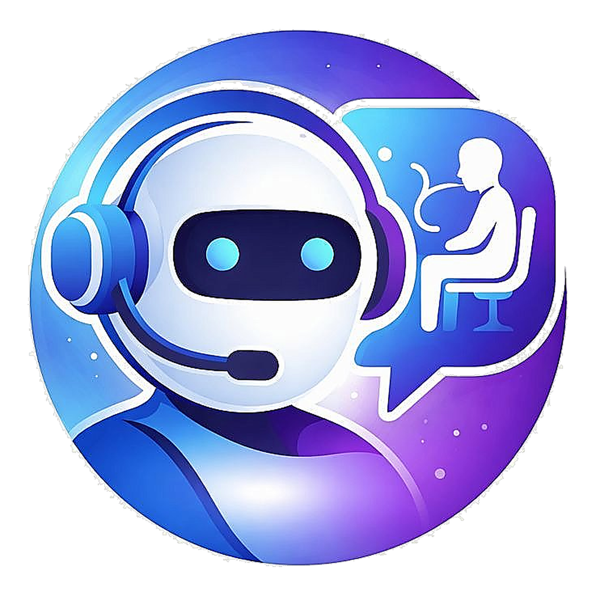

 

## 🚀 Official Releases & Links  
*   **iOS App Store**: [Download for iPhone](https://apps.apple.com/app/interviprep-ai-interview-coach/id6740698114)
*   **Google Play Store**: [Download for Android](https://play.google.com/store/apps/details?id=com.antigravity.aiinterviewcoach)
*   **Official Website**: [interviprep.ai](https://www.interviprep.ai/)
*   **Contact & Technical Support**: [support@interviprep.ai](mailto:support@interviprep.ai)

---

## 🎯 Key Value Propositions & Metrics
*   ⚡ **Adaptive AI Questioning**: Real-time interviewer that adapts follow-up questions to your resume, target role, and answer depth.
*   🎙️ **Speech-to-Text**: Low-latency reactive voice simulation featuring beautiful audio waveform visualizations.
*   📄 **ATS Resume Optimizer**: Instant scoring, keyword suggestions, and improvement breakdown to beat automated HR screening.
*   📊 **Interview Readiness Score**: Comprehensive metric tracking across Technical, Behavioral, and Leadership competencies.
*   🔥 **Proven Success**: Driving massive user conversions

---

## 📱 Application Screenshots
Explore the premium, glassmorphic Material 3 mobile application interface designed to elevate your interview readiness:

  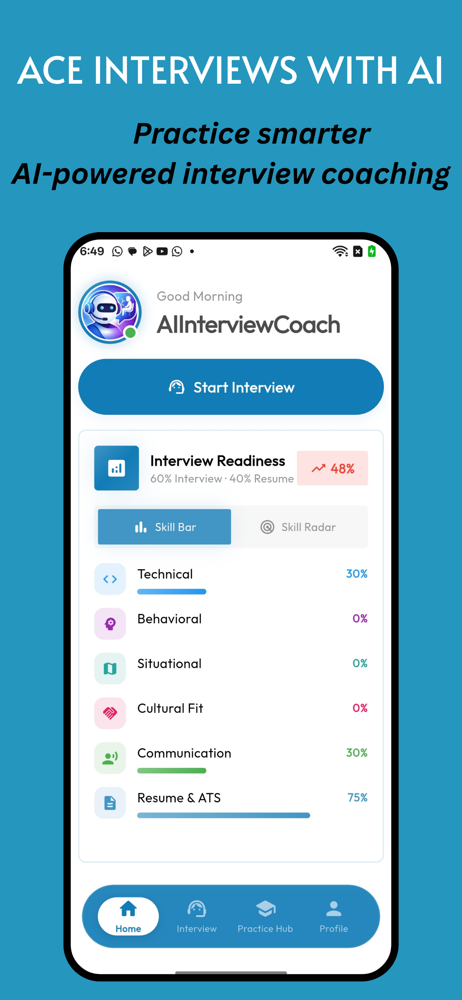 &nbsp;
  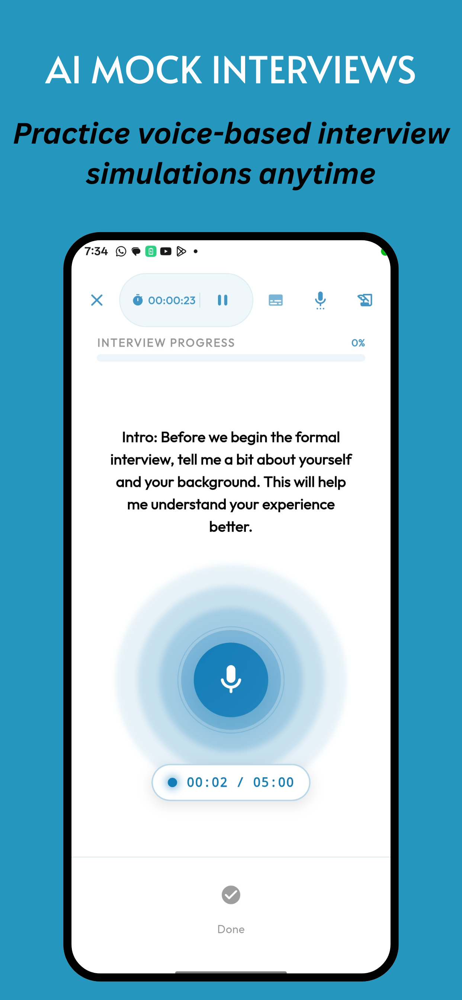 &nbsp;
  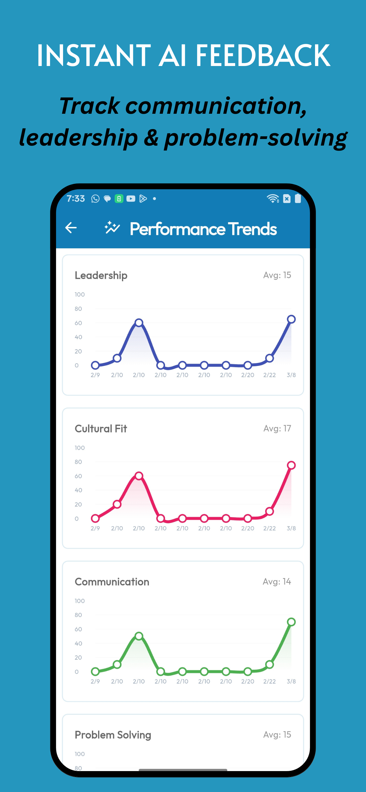 &nbsp;
  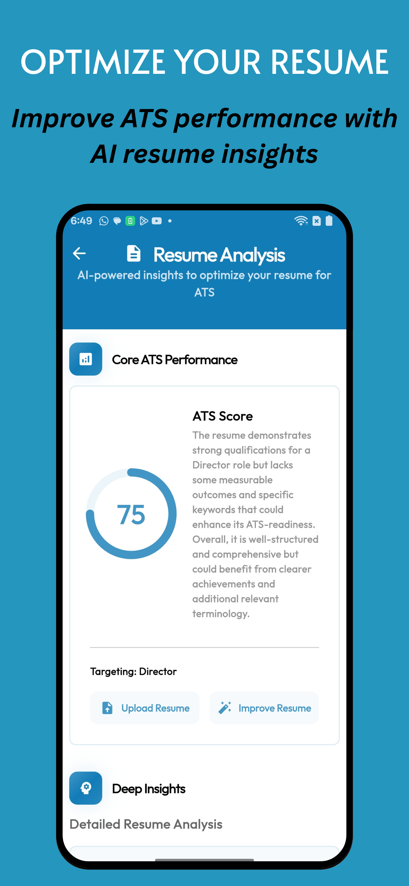

  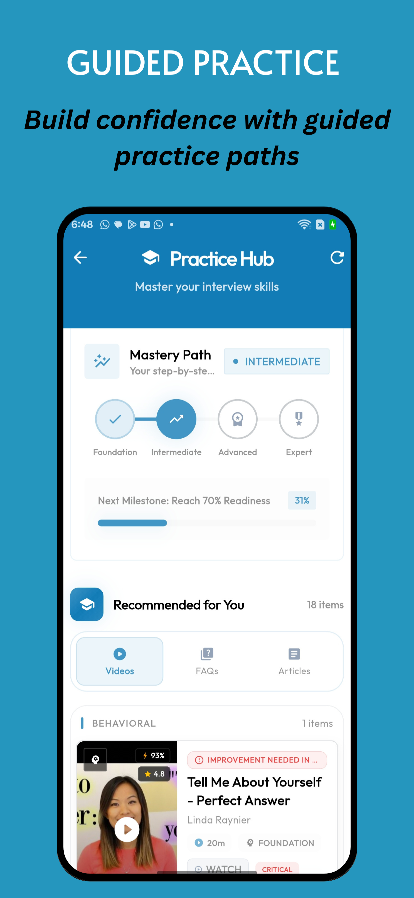 &nbsp;
  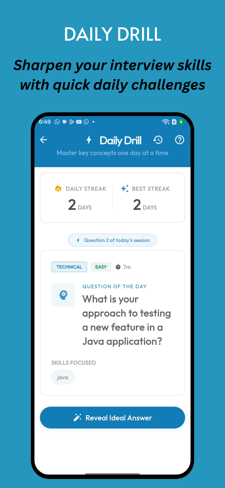 &nbsp;
  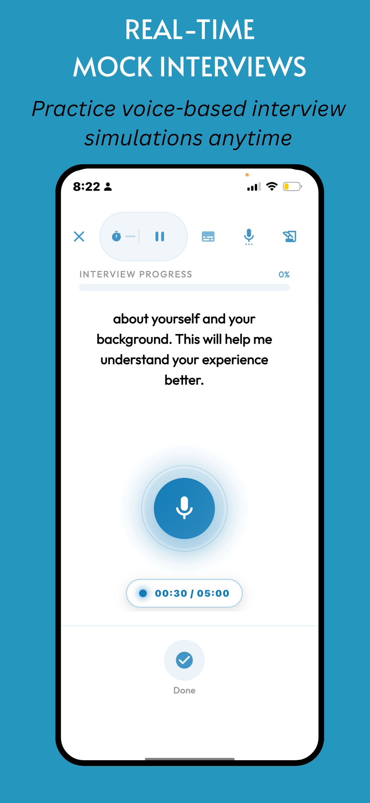 &nbsp;
  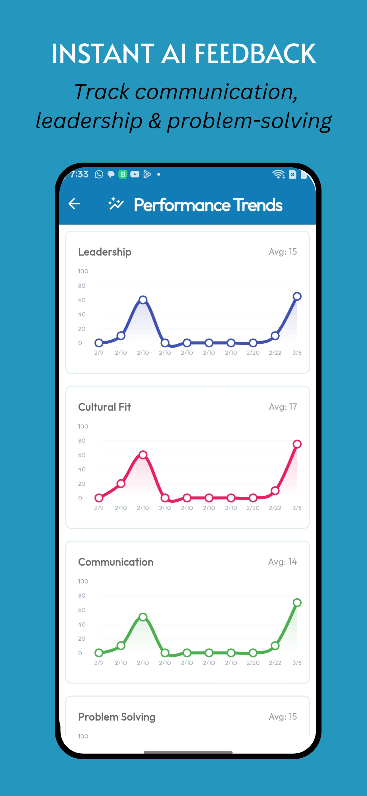

  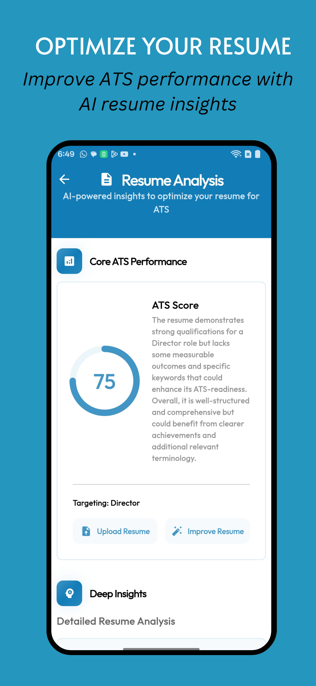 &nbsp;
  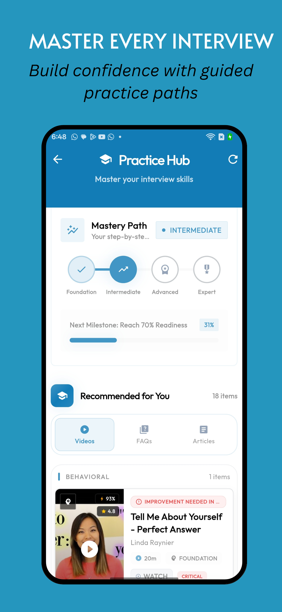 &nbsp;
  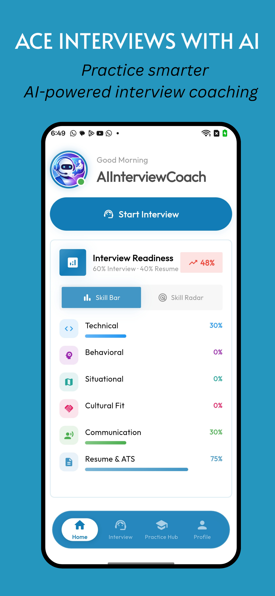

---

## 🦾 Key Features & Modules

### 1. AI Mock Interview Simulator
*   **Tailored Setup**: Choose your Target Role, Seniority, Company Culture, Interview Difficulty, AI Interviewer Personality (supportive, professional, or challenger), Speech Accents, and Question Focus.
*   **Voice Practice Engine**: Low-latency voice interaction with dynamic follow-ups, silence guards, and responsive audio visualizers.
*   **AI Interviewer Avatar**: Reactive animated avatar that changes expressions (happy, curious, encouraging) dynamically based on your spoken answers.

### 2. Smart Practice Hub (Ecosystem)
*   **Hyper-Personalized Path**: Identifies skill gaps and dynamically suggests:
    *   Targeted Video Masterclasses & Tutorials
    *   Contextual FAQs & Best Practice Articles
    *   Daily Drills with automated notifications to lock in learning consistency.

### 3. Deep Performance Analytics
*   **Readiness Radar**: Advanced high-fidelity visual analysis displaying "Actual vs. Target (85%)" across multiple core domains.
*   **Session Playback**: Rerun past interviews, read exact voice transcripts, and study detailed AI feedback for every single question.

---

## 🏗️ High-Level Platform Architecture

InterviPrep is built using a highly scalable, decoupled architecture to ensure maximum performance, privacy, and speed.

### User Journey & Session Lifecycle

The platform manages the user lifecycle from onboarding to final summary diagnostics using an secure event-driven flow:

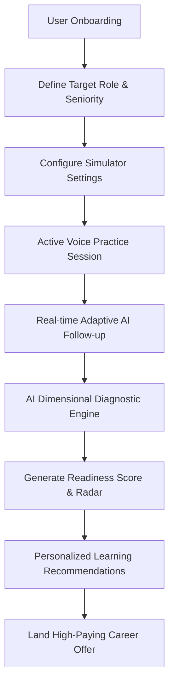

### ⚙️ Tech Stack Highlights
*   **Mobile Interface**: Flutter (Material 3 custom design system featuring HSL color palettes and smooth glassmorphism blurs).
*   **Data & Services**: Supabase Secure Authentication, Realtime PostgreSQL databases, and low-latency storage.
*   **AI Integration**: Supabase Edge Functions orchestrating advanced large language models and cognitive transcription pipelines.

---

*Designed and engineered with care by the **InterviPrep Team**. Copyright &copy; 2026 InterviPrep.*
