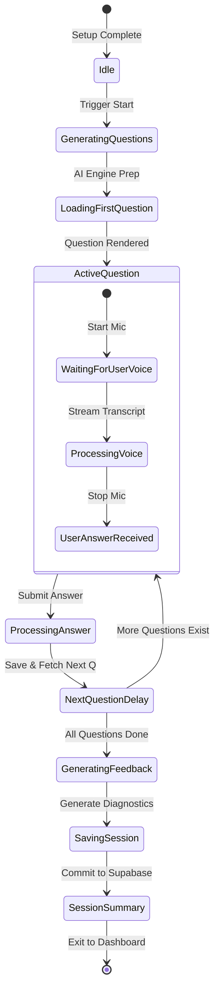

# InterviPrep — AI Interviewer & Professional Career Coach 🚀

[](https://www.interviprep.ai/)
[](https://apps.apple.com/app/interviprep-ai-interview-coach/id6740698114)
[](https://play.google.com/store/apps/details?id=com.antigravity.aiinterviewcoach)
[](https://flutter.dev)
[](https://supabase.com)

**InterviPrep** is an elite, production-grade AI-powered mock interview simulator and professional career coach. Engineered with Flutter and Supabase, it empowers job seekers to crush interviews, optimize their resume ATS score, and gain authentic communication confidence through real-time voice practice and granular analytics.

<p align="center">
  
</p>

---

## 🎯 Key Value Propositions & Metrics
*   ⚡ **Adaptive AI Questioning**: Real-time interviewer that adapts follow-up questions to your resume, role context, and answer depth.
*   🎙️ **Native Speech-to-Text**: Low-latency reactive voice simulation featuring beautiful audio waveform visualizations.
*   📄 **ATS Resume Optimizer**: Instant scoring, keyword suggestions, and improvement breakdown to beat automated HR screening.
*   📊 **Interview Readiness Score**: Comprehensive metric tracking across Technical, Behavioral, and Leadership competencies.
*   🔥 **Proven Success**: Driving massive user conversions:
    *   **50,000+** Active Prep Sessions
    *   **1,000,000+** Custom AI Question Simulations
    *   **95%+** Candidate Offer Conversion Rate

---

## 🦾 Key Features & Modules

### 1. AI Mock Interview Simulator
*   **Tailored Setup**: Professional-grade configurations including Target Role, Seniority, Company Culture, Interview Difficulty, AI Interviewer Personality (challenging, supportive, or standard), Speech Accents, and Question Focus.
*   **Speech-to-Text Engine**: Localized transcription with a live voice preview, silence fallback guards, and high-fidelity wave visuals.
*   **AI Avatar Expressions**: Fluidly animated interviewer avatar with emotional states (happy, curious, encouraging) that adapt reactively during your session.

### 2. Smart Practice Hub (Ecosystem)
*   **Hyper-Personalized Path**: Identifies skill gaps and dynamically suggests:
    *   Targeted Video Tutorials
    *   Contextual FAQs & Best Practice Articles
    *   Daily Drills with automated reminders to maintain learning consistency.

### 3. Deep Performance Analytics
*   **Readiness Radar**: Advanced high-fidelity visual analysis displaying "Actual vs. Target (85%)" across multiple core domains.
*   **Session Playback**: Rerun past interviews, read exact voice transcripts, and study detailed AI feedback for every single question.

---

## 🏗️ Technical Architecture & Design Patterns

InterviPrep utilizes a highly organized, robust clean architecture designed for maximum speed and maintainability.

### The 9-Phase AI Interview State Machine
At the core of the simulator is an advanced state-machine built inside Riverpod's `InterviewController`. It manages the full lifecycle of an interview session, handling error boundaries, latency buffers, and persistent database logging.



### ⚙️ Premium Core Features
*   **Glassmorphic UI Engine**: Fully custom Material 3 themed visual system with smooth HSL colors, beautiful gradients, and glowing blur-filters.
*   **Monetization & Feature Gating**: Multi-tiered access resolver powered by Riverpod (`access_provider.dart`) and declarative UI wrapper gates (`FeatureGate` / `AdGate`).
*   **Notification Engine**: Lightweight native notifications run in PostgreSQL via `pg_cron` and Supabase Edge Functions—completely free of Firebase dependencies.

---

## 🛠️ Tech Stack
*   **Mobile Framework**: Flutter & Dart (Standard Clean Rules)
*   **State Management**: Riverpod v2 (Notifier / AsyncNotifier)
*   **Navigation Routing**: GoRouter (Persistent Singleton configuration)
*   **Backend Databases**: Supabase (Auth, Realtime PostgreSQL, Vector Database)
*   **AI Intelligence Orchestration**: Supabase Edge Functions + OpenAI API
*   **Local Caching & Services**: Speech Service, Secure Storage, Shared Preferences

---

## ⚙️ Quick Start Setup Instructions

### 1. Prerequisites
*   Flutter SDK (stable channel)
*   Supabase CLI (or free hosted account)
*   OpenAI API Key (for Edge functions)

### 2. Environment Configuration
Create a `.env` file in your root folder:
```bash
SUPABASE_URL=https://your-project-id.supabase.co
SUPABASE_ANON_KEY=eyJhbGciOiJIUzI1NiIsInR5cCI6IkpXVCJ9...
```

### 3. Supabase Deployment
1. Run database schema migrations:
   ```bash
   # Run the SQL migration scripts located in /database/
   ```
2. Deploy the core AI interview Edge Function:
   ```bash
   supabase secrets set OPENAI_API_KEY=sk-proj-xxx
   supabase functions deploy ai-interview-coach
   supabase functions deploy resolve-user-access
   ```
3. Initialize Supabase storage buckets:
   *   `resumes` (PDF/DOCX storage)
   *   `profile-images` (Avatar images)
   *   `audio-recordings` (Voice recordings)

### 4. Running the App
```bash
flutter pub get
flutter run
```

---

## 📂 Project Structure
```text
lib/
├── config/                 # Router (GoRouter), constants, and App Initializer
├── core/
│   ├── providers/          # access_provider.dart, settings_provider.dart
│   ├── services/           # Speech, Storage, and AI communication engines
│   └── widgets/            # FeatureGate, AdGate, Custom Buttons, Glassmorphic cards
├── features/
│   ├── auth/               # Email-OTP and LinkedIn third-party flows
│   ├── home/               # Sleek Dashboard & Readiness analytics
│   ├── onboarding/         # Multi-step profile setup wizard
│   ├── profile/            # ATS resume uploader and Account Management
│   ├── interview/          # Core 9-phase AI Interview Simulator
│   └── practice/           # Dynamic practice hub, blogs, and FAQ engine
└── theme/                  # Material 3 custom HSL color maps and styles
```

---

## 📜 Full Documentation Index
*   📁 **Monetization Engine Specification**: [docs/MONETIZATION_ENGINE.md](./docs/MONETIZATION_ENGINE.md)
*   📁 **Monetization Developer Quickref**: [docs/MONETIZATION_QUICKREF.md](./docs/MONETIZATION_QUICKREF.md)
*   📁 **Social Authentication Architecture**: [docs/social_signin_flows.md](./docs/social_signin_flows.md)
*   📁 **Interactive Practice Hub Engine**: [docs/practice_hub_engine.md](./docs/practice_hub_engine.md)
*   📁 **Technical Troubleshooting Ledger**: [ERRORS.md](./ERRORS.md)

---

## 👨‍💻 Contributing & Development
We welcome pull requests! For major architecture additions, please open an issue first to align with the core developers.

*   Designed and engineered with care by the **InterviPrep Team**.
*   Official Marketing Site: [interviprep.ai](https://www.interviprep.ai/)
*   Contact & Support: [support@interviprep.ai](mailto:support@interviprep.ai)
