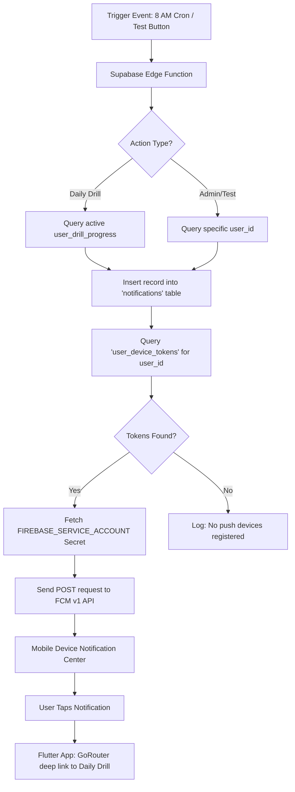

# InterviPrep: Push Notification System Guide

This document outlines the architecture, execution flow, and deployment steps for the Native Push Notification system using **Supabase Edge Functions** + **Firebase Cloud Messaging (FCM)**.

---

## 1. System Architecture & Flow

The system follows a "Brain & Gateway" architecture. Supabase handles the logic (Brain), and Firebase handles the delivery (Gateway).

### Execution Flow Chart

---

## 2. Key Components

### A. Database (`public.user_device_tokens`)
Stores unique FCM tokens mapped to `auth.users`. 
*   **Registration**: Handled via `register_device_token` RPC.
*   **Cleanup**: Automatically updates `last_seen_at` on every app launch.

### B. Flutter App (`NotificationService`)
*   **Initialization**: Requests OS permissions & registers token on startup.
*   **Handlers**:
    *   **Foreground**: Displays a local overlay if the user is currently in the app.
    *   **Background/Terminated**: Routes the user to `/daily-drill` via GoRouter.

### C. Edge Function (`daily-drill-notifier`)
*   **Trigger**: Can be called via HTTP or scheduled via Supabase Cron.
*   **Payload**: Uses a "silent data" payload to allow the app to fetch the latest drill data upon opening.

---

## 3. Functionality Validation Criteria

| Requirement | Success Criteria |
| :--- | :--- |
| **User Permission** | App must prompt for notifications on first launch (post-login). |
| **Token Registration** | A record appears in `user_device_tokens` after login. |
| **Foreground Alert** | If the app is open, a notification should appear as an in-app banner. |
| **Background Push** | If the app is closed, a system tray notification appears with sound. |
| **Deep Linking** | Tapping the push MUST land the user on the Daily Drill screen, not Home. |
| **Token Expiry** | If a user logs out, the token should be ignored or deleted (Security). |

---

## 4. Production Deployment Checklist

### Phase 1: Infrastructure
- [ ] **Firebase Console**: Enable the "Firebase Cloud Messaging API (V1)" in the Google Cloud Console.
- [ ] **Apple Developer (iOS Only)**: 
    - Create a "Push Notifications" Auth Key (.p8 file).
    - Upload .p8 key to Firebase Console -> Project Settings -> Cloud Messaging.
- [ ] **Supabase Secrets**: 
    - Ensure `FIREBASE_SERVICE_ACCOUNT` is set in the Production Supabase project.

### Phase 2: Building & Signing
- [ ] **Android**: Ensure `google-services.json` is correctly placed in `android/app/`.
- [ ] **iOS**:
    - Ensure `GoogleService-Info.plist` is in the `Runner` folder.
    - Enabled "Push Notifications" capability in Xcode.
    - Enabled "Remote notifications" in Background Modes.

### Phase 3: Deployment
- [ ] **Edge Functions**: Deploy the function using `supabase functions deploy daily-drill-notifier`.
- [ ] **Database**: Apply migrations to the production database via `supabase db push`.
- [ ] **Cron**: Enable the daily cron job in Supabase to trigger the function at 08:00 UTC.

---

## 5. Troubleshooting Guide

*   **Error: "Not found: package:firebase_core"**: Run `flutter pub get` to download dependencies.
*   **Notifications not appearing on iOS**: Check that you are testing on a **physical iPhone**. Push notifications do not work on the iOS Simulator.
*   **FCM 401 Unauthorized**: The `FIREBASE_SERVICE_ACCOUNT` secret is either missing or has incorrect permissions in the Google Cloud Console.
