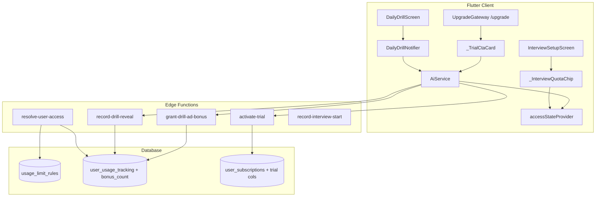

# InterviPrep — Feature Documentation & Validation Scenarios
### Monetization Gating System (Drill Ad Bonus + Trial CTA)
> Generated: 2026-03-09 · Project: `qogderhgxrhyuptimxsi` (AI Interview Coach)

---

## 1. Architecture Overview



---

## 2. Database Schema Reference

### `usage_limit_rules` — Live Data (from DB)

| rule_key | tier | max_count | window_type |
|---|---|---|---|
| `mock.interviews` | FREE | **1** | weekly |
| `mock.interviews` | PRO | -1 (unlimited) | weekly |
| `mock.interviews` | ELITE | -1 | weekly |
| `mock.questions` | FREE | **3** | weekly |
| `mock.questions` | PRO | -1 | weekly |
| `mock.questions` | ELITE | -1 | weekly |
| `daily_drill.questions` | FREE | **1** | daily |
| `daily_drill.questions` | PRO | -1 | daily |
| `daily_drill.questions` | ELITE | -1 | daily |

### `user_usage_tracking` — Per-User Counters

| Column | Type | Role |
|---|---|---|
| `user_id` | uuid | FK → auth.users |
| `rule_key` | text | matches `usage_limit_rules.rule_key` |
| `window_start` | date | ISO Monday (weekly) or today (daily) |
| `window_type` | text | `daily` \| `weekly` |
| `usage_count` | integer | events used in window |
| `bonus_count` | integer | **ad-granted extra reveals** |

> Unique constraint: `(user_id, rule_key, window_start)`

### `user_subscriptions` — Subscription + Trial

| Column | Type | Role |
|---|---|---|
| `tier` | text | `'FREE'` \| `'PRO'` \| `'ELITE'` |
| `is_trial_active` | boolean | true during 3-day trial |
| `trial_started_at` | timestamptz | when trial began |
| `trial_expires_at` | timestamptz | trial end timestamp |
| `trial_used` | boolean | **one-per-lifetime gate** |

---

## 3. Feature: Daily Drill Quota + Ad Bonus

### Flow Diagram

```
FREE User Opens Daily Drill
         │
         ▼
  Q1: "Reveal Ideal Answer"
         │
         ├──► recordDrillReveal() → record-drill-reveal EF
         │         └──► increment_drill_usage('daily_drill.questions', 1)
         │
         ▼
  showAnswer = true ✓     usage_count = 1  →  remaining = 0
         │
         ▼
  [User at limit — showAdCta appears]
  "Watch Ad • +1 Question"
         │
         ▼
  watchAdForBonus() [5s countdown]
         │
         ├──► grantDrillAdBonus() → grant-drill-ad-bonus EF
         │         └──► grant_drill_ad_bonus() RPC
         │               bonus_count += 1
         │               effectiveLimit = max_count + bonus_count = 2
         │               remaining = 2 - 1 = 1   ✓
         │
         ▼
  adBonusGranted = true  (1.5s green flash)
         │
         ▼
  _loadNextQuestion() → next question card
```

### Validation Scenarios — Daily Drill

#### Scenario D-1: First reveal of the day (FREE)
**Precondition:** Fresh day, `usage_count = 0`

| Step | Action | Expected Result |
|---|---|---|
| 1 | Open Daily Drill | Question card visible, Reveal button shown |
| 2 | Tap "Reveal Ideal Answer" | Answer slides in; `record-drill-reveal` called |
| 3 | Check DB | Row: `usage_count = 1`, `bonus_count = 0` |
| 4 | Check access state | `remaining = 0`, `isAtLimit = true` |
| 5 | Check UI | "Watch Ad • +1 Question" card appears |

#### Scenario D-2: Watching ad for bonus reveal (FREE)
**Precondition:** D-1 complete, user is at daily limit

| Step | Action | Expected Result |
|---|---|---|
| 1 | Tap "Watch Ad • +1 Question" | Countdown ring animates for 5 seconds |
| 2 | After 5s | `grant-drill-ad-bonus` called; `bonus_count = 1` |
| 3 | Brief flash | Green "+1 Question Unlocked!" message (1.5s) |
| 4 | After flash | Next question card loads |
| 5 | Check DB | `usage_count = 1`, `bonus_count = 1`, effective remaining = 1 |

#### Scenario D-3: PRO/ELITE user — no ad gate
**Precondition:** PRO subscription active

| Step | Action | Expected Result |
|---|---|---|
| 1 | Open Daily Drill | Question loads |
| 2 | Tap "Reveal Ideal Answer" | Answer revealed; **no ad CTA** |
| 3 | Next question | Loads directly without interstitial |
| 4 | `resolve-user-access` | `daily_drill.questions.limit = -1` (unlimited) |

#### Scenario D-4: Usage resets every day
**Precondition:** Yesterday: `usage_count = 1`

| Step | Action | Expected Result |
|---|---|---|
| 1 | New calendar day, open Daily Drill | Fresh question loads |
| 2 | Check DB | New row: `window_start = today`, `usage_count = 0` |
| 3 | Check access state | `remaining = 1`, `isAtLimit = false` |

---

## 4. Feature: Interview Setup Quota Chip

### Widget States

```
accessStateProvider.getUsageLimit('mock.interviews')
         │
         ├── isPaidUser         → [hidden]
         ├── isUnlimited        → [hidden]
         ├── remaining > 0      → 🟢 Green pill
         └── isAtLimit          → 🟡 Amber banner + "Upgrade →"
```

### Validation Scenarios — Interview Setup

#### Scenario I-1: FREE user, quota remaining
**Precondition:** `mock.interviews` usage = 0 this week

| Step | Action | Expected Result |
|---|---|---|
| 1 | Navigate to Interview Setup | Page loads |
| 2 | Scroll to FAB | 🟢 *"1 of 1 mock interview remaining this week"* |
| 3 | Tap Start Interview | Interview starts |
| 4 | After interview | Return to setup → 🟡 amber chip shown |

#### Scenario I-2: FREE user at weekly limit
**Precondition:** `usage_count = 1` (limit = 1)

| Step | Action | Expected Result |
|---|---|---|
| 1 | Navigate to Interview Setup | 🟡 Amber banner: *"Weekly limit reached (1/1)"* |
| 2 | Tap "Upgrade →" | Navigates to `/upgrade?feature=mock.weekly` |
| 3 | Tap Start Interview | `UpgradeModal.show()` blocks with upsell |

#### Scenario I-3: PRO user
**Precondition:** PRO subscription active

| Step | Action | Expected Result |
|---|---|---|
| 1 | Navigate to Interview Setup | Quota chip **not visible** |
| 2 | Start Interview | No limit check block |

---

## 5. Feature: 3-Day Free Trial

### Flow Diagram

```
FREE User Hits Locked Feature
         │
         ▼
GoRouter → /upgrade?feature=<key>
         │
         ▼
UpgradeGateway:
  ├─ _TrialCtaCard [shown if: isFree && !isTrialActive]
  │      "Try PRO Free for 3 Days"
  │       onTap → AiService.activateTrial()
  │                    └── activate-trial EF
  │                         └── activate_free_trial() RPC
  │                              ├─ Eligible: is_trial_active=true, expires +3d
  │                              └─ Ineligible: returns reason code
  │
  └─ _ComparisonTable (Free vs PRO)
```

### Validation Scenarios — Trial CTA

#### Scenario T-1: Eligible FREE user activates trial
**Precondition:** `trial_used = false`, `tier = 'FREE'`

| Step | Action | Expected Result |
|---|---|---|
| 1 | Navigate to locked route | Redirected to UpgradeGateway |
| 2 | See UpgradeGateway | `_TrialCtaCard` visible with pulse animation |
| 3 | Tap "Activate Free Trial" | EF called; short loading state |
| 4 | Success | Purple SnackBar: *"🎉 Your 3-day ELITE trial is now active!"* |
| 5 | Redirect | Goes to `/` (home) |
| 6 | Check DB | `is_trial_active = true`, `trial_used = true`, `trial_expires_at ≈ NOW() + 3d` |
| 7 | Feature access | ELITE features now unlocked |

#### Scenario T-2: Trial already used (ineligible)
**Precondition:** `trial_used = true`

| Step | Action | Expected Result |
|---|---|---|
| 1 | Navigate to UpgradeGateway | `_TrialCtaCard` **not shown** |
| 2 | UI shows | Comparison table only |

#### Scenario T-3: PRO user on UpgradeGateway
**Precondition:** Active PRO subscription

| Step | Action | Expected Result |
|---|---|---|
| 1 | Visit `/upgrade` directly | No trial card (`isFree = false`) |
| 2 | Tier column | *"Yours"* badge on PRO |

#### Scenario T-4: Network failure during activation
**Precondition:** EF returns error / network timeout

| Step | Action | Expected Result |
|---|---|---|
| 1 | Tap "Activate Free Trial" | EF called |
| 2 | Error occurs | `activateTrial()` throws `Exception(message)` |
| 3 | Shown to user | Red SnackBar with error reason |
| 4 | DB state | `trial_used` remains `false` (atomic RPC not committed) |

---

## 6. Edge Function Contracts

### `activate-trial` (POST)
```
POST /functions/v1/activate-trial
Authorization: Bearer <user-jwt>

200: { success: true, trial_expires_at: "2026-03-12T...", message: "..." }
409: { success: false, message: "You have already used your free trial." }
401: { error: "Unauthorized" }
500: { error: "Internal server error" }
```

### `record-drill-reveal` (POST)
```
POST /functions/v1/record-drill-reveal
Authorization: Bearer <user-jwt>

200: { success: true }   ← always 200 (fire-and-forget)
```

### `grant-drill-ad-bonus` (POST)
```
POST /functions/v1/grant-drill-ad-bonus
Authorization: Bearer <user-jwt>
Body (optional): { "rule_key": "daily_drill.questions" }

200: { success: true, remaining: 1, bonus_count: 1 }
500: { error: "Failed to grant bonus" }
```

### `resolve-user-access` (GET)
```
GET /functions/v1/resolve-user-access
Authorization: Bearer <user-jwt>

200: {
  tier: "FREE",
  is_trial_active: false,
  features_enabled: ["mock.weekly", "daily_drill.basic", ...],
  usage_limits: {
    "mock.interviews":       { limit: 1, used: 0, remaining: 1, window: "weekly" },
    "mock.questions":        { limit: 3, used: 0, remaining: 3, window: "weekly" },
    "daily_drill.questions": { limit: 2, used: 1, remaining: 1, window: "daily" }
    //                 bonus applied: effectiveLimit = max_count + bonus_count
  }
}
```

---

## 7. SQL Validation Queries

```sql
-- 1. Confirm quota rules are seeded correctly
SELECT rule_key, tier, max_count, window_type
FROM public.usage_limit_rules
ORDER BY rule_key, tier;

-- 2. Check a user's drill usage for today
SELECT rule_key, window_start, usage_count, bonus_count,
       usage_count AS used,
       (SELECT max_count FROM public.usage_limit_rules
        WHERE rule_key = t.rule_key AND tier = 'FREE') + bonus_count AS effective_limit
FROM public.user_usage_tracking t
WHERE user_id = '<user-uuid>'
  AND rule_key = 'daily_drill.questions'
  AND window_start = current_date;

-- 3. Check trial activation status
SELECT tier, is_trial_active, trial_started_at,
       trial_expires_at, trial_used,
       trial_expires_at > now() AS is_still_active
FROM public.user_subscriptions
WHERE user_id = '<user-uuid>';

-- 4. Check weekly mock interview usage
SELECT rule_key, window_start, usage_count
FROM public.user_usage_tracking
WHERE user_id = '<user-uuid>'
  AND rule_key = 'mock.interviews'
  AND window_start = date_trunc('week', now())::date;

-- 5. Test activate_free_trial RPC directly
SELECT public.activate_free_trial('<user-uuid>');
-- Fresh user:  {"success": true, "trial_expires_at": "2026-03-12T..."}
-- Used trial:  {"success": false, "reason": "trial_already_used"}
-- Non-free:    {"success": false, "reason": "not_free_tier"}

-- 6. Reset trial for re-testing (DEV ONLY — never run in production)
UPDATE public.user_subscriptions
SET trial_used = false, is_trial_active = false,
    trial_started_at = null, trial_expires_at = null
WHERE user_id = '<user-uuid>';
```

---

## 8. Dart Constants Quick Reference

```dart
// Feature keys — must match features table in DB exactly
FeatureKeys.mockWeekly          // 'mock.weekly'
FeatureKeys.dailyDrillBasic     // 'daily_drill.basic'
FeatureKeys.learningAdaptive    // 'learning.adaptive'
FeatureKeys.dailyDrillUnlimited // 'daily_drill.unlimited'
FeatureKeys.adsDisable          // 'ads.disable'

// Usage limit rule keys — must match usage_limit_rules.rule_key exactly
UsageLimitKeys.mockInterviews      // 'mock.interviews'       → weekly window
UsageLimitKeys.mockQuestions       // 'mock.questions'        → weekly window
UsageLimitKeys.dailyDrillQuestions // 'daily_drill.questions' → daily window

// accessStateProvider API (reactive — use ref.watch for live updates)
access.isFree                             // tier == 'FREE'
access.isPaidUser                         // PRO or ELITE
access.isTrialActive                      // 3-day trial running
access.canAccess(FeatureKeys.xyz)         // feature gate check (boolean)
access.isAtLimit(UsageLimitKeys.xyz)      // quota exhausted?
access.getUsageLimit(UsageLimitKeys.xyz)  // → UsageLimitEntry
  // .limit       → max_count (-1 = unlimited)
  // .used        → usage_count
  // .remaining   → limit - used  (-1 = unlimited)
  // .isAtLimit   → remaining == 0
  // .isUnlimited → limit == -1
```

> **Note:** `_InterviewQuotaChip` and `DailyDrillScreen` both use `ref.watch(accessStateProvider)` — they live-update automatically when `accessProvider.notifier.refreshUsage()` is called after any Edge Function write.

> **Important — Trial features unlock:** `activate_free_trial()` RPC only sets `is_trial_active = true`. Feature unlocking during the trial depends on `resolve-user-access` EF reading that flag and appending trial-tier feature keys to `features_enabled`. Verify this branch exists in the EF if trial features don't unlock as expected.

> **Warning — Ad simulation in production:** `watchAdForBonus()` currently uses `Future.delayed(5s)` to simulate a rewarded ad. Replace with a real Ad SDK call before release. The `grant-drill-ad-bonus` EF currently trusts the client implicitly — add server-side ad verification tokens before production to prevent abuse.
